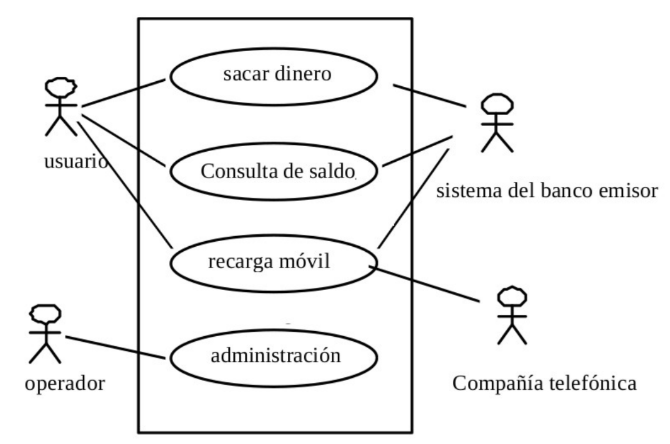
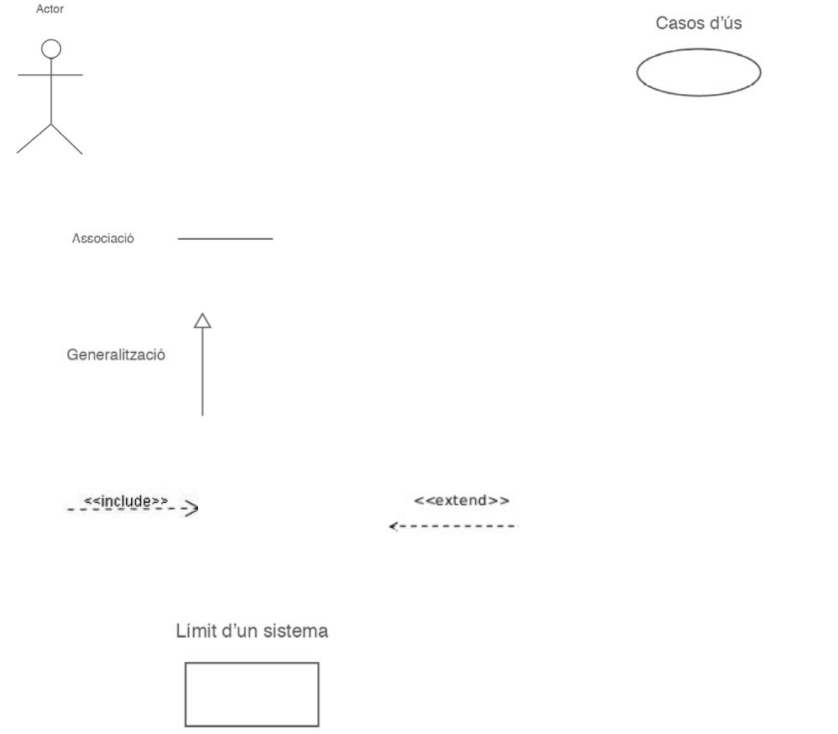
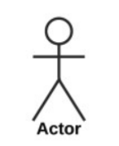
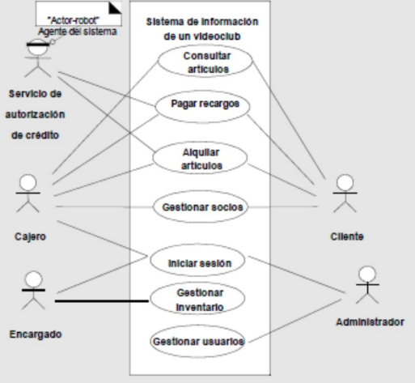
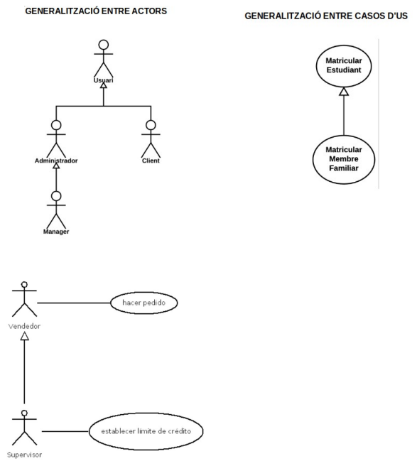
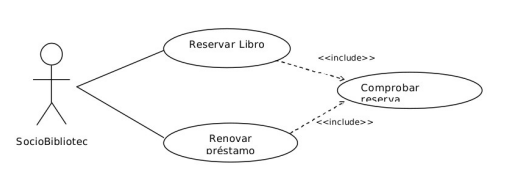
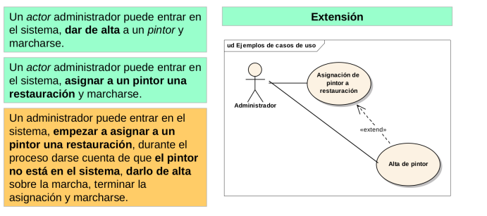

# Diagrames de Casos d'us

## Resum

- [**Actor** i **cas d'us** : **Associacio**](#associacio)
- [**Entre Actors** : **Generalitzacio**](#genralitzacio--especialitzacio)
- [**Entre casos d'us : Generalitzacio Inclusio Extensio**](#dependencia-de-inclusio)

## Introducció

Serveis per **mostrar les funcions d'un programa** des el punt de **vista del client**.
_No entra en la implementacio de les funcions_

S'aconsegueix mostrar el comportament del programa.

### On s'utilitze

- Recollida de Documentacio.
- Fase D'anilisi.

### Que representa un diagrama de cassos d'us

Els requeriments que fan servir el clients.

#### tipus de diagrames

d**actors** i de **casos d'us**.

- Crea les funcionalitats que pot oferir el sistema.
  **Cada cas d'us dona una resposta nomes a una caracteristica concreta del programa**
  Aixi l'usuari valida facilment que han entes correctament les funcions del programa.

### Exemple de cas d'us

## Elements del diagrama d'us

- Actor
- Cas d'us
- Relaccio
  - Associacio
  - Extensio
  - Inclusio
  - Generalitzacio

## Actor

Conjunt de papers (**entitat fisica o Virtual**), l'actor interactua amb el subjecte(casos d'us).
**Tot allo que inicia o respon un cas d'us es considera Actor**

### Un Actor pot ser:

- Usuari
  - El primer que interactua amb un subject
- Sistema Informatic
  - Reb informacio o Doni
- Dispositiu Fisic
  - Comportament propi
- Temps Rellotge, _s'engega automaticament en una hora determinada_
  

## Cas d'us

**Comportament executant** engegat de manera directa o indirecta per un actor.
**lliura resultats concrets a un o diversos actors o altre cas d'us**

### Com es representa un Cas d'us

**Mitjançant un verb** que indica una:

- Accio
- Operacio
- Tasca concreta
  El actor podra fer una peticio i generi el cas d'us o be un altre cas d'us qui l'invoqui.
  

## Relacions

Vincle que es dona entre casos d'us y actors

### Tipus de relacions

## Associacio

Comunicacio entre actor i cas d'us. l'actor participa en el cas d'us.

#### Exemple Associacio

## Genralitzacio / Especialitzacio

Es com una subclase y superclase, la subclase pot fer tot lo de la superclase y mes, pero la superclase no pot fer lo de la subclase. Aixo tambe pase en els cas d'us y actors.
En actor si la flexa apunta a un altra actor, per exemple:

- un Devops Sr apunta (fa una generalitzacio) a un devops Jr.
- el Devops Sr podra fer tot el que fa el devops jr y mes.
- pero el jr no podra fer el que fa el sr.

##### Exemeples Genralitzacio / Especialitzacio

## Dependencia de Inclusio

**Indica que un cas d'us esta inclos en una altre**, succeix cuan comparteixen uns elements.

#### On se inclouen

**Al que tindra tots els comportaments compartits.**
_tambe anomenar **use**_ perque hereda o utilitza caracteristiques de la relacio.

#### Cuan es Util

En comportaments comuns, des de molts casos d'us a una descripcio individual.
**No hi ha parametres o valors de retorn**

**Quan un cas d’ús A és inclòs per un altre cas d’ús B, el cas d’ús que ha
incorporat el comportament de l’altre, en aquest cas el cas d’ús B, haurà de ser
utilitzat per si mateix.**
Exemeple, tengo un caso de uso que es comprar y para comprar necesito buscar productos, primero entrare en compra pero como hay un include que va hacia buscar producto primero realizare el buscar producto y luego compro el producto

**Si no es coneix com _cas d'us abtracte_**

#### Exemple de Inclusio

## Dependencia de Extensio

Alternativa a l'us de casos d'us complexos. Amb les depencies d'extensio **es poden cotrolar millor les bifrucacions i errors**
**La extensio es si tu vols ho pots fer pero no cal.**

#### Exemple Extensio

