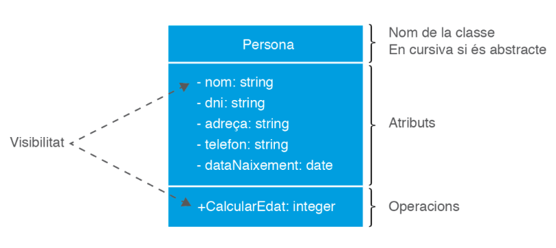
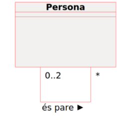
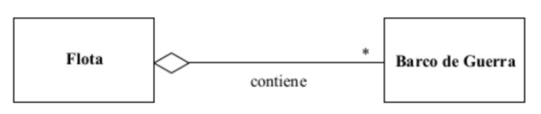
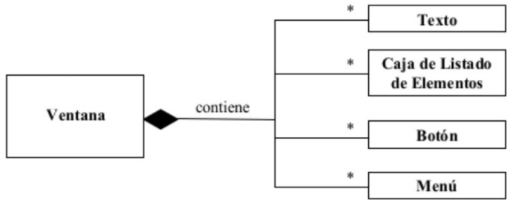

# Introdució

## UML (Llenguatge unificar de modelitzacio)

- En Ingles **_Unified Modeling Language_**

Conjunto de notaciones grafiques que sirven para:

- Especificar
- Dissenyar
- Elaborar
- Documentar model de sistemas

**Tot aixo per aplicacions informatiques.**

**L'analista i el dissenyador** _recrearan les carecteristiques_ que caldra que tingui l'aplicacio _per crear posteriorment_.

Un del **_beneficis_** de la actualitat sobre el llenguatges de modelitzacion son les _eines de modelitzacio de programas orientat a objecte_.

_Avantages_ de UML(Llenguatge unficat de modelitzacio):

- Recolzada per **l'estandar del desenvolupament de projectes infomartics** _OMG(Object Management Group)_
- Notacio grafica concreta
- Us de **_diagramas amb el detall de les carecteristiques_** del programa.
- Visio global del sistema.
- Promou la _reutilitzacio_.

_Desventatges_ de UML(Llenguatge unificar de modelitzacio):

- Es una _notació_.
- No es Programacio.
- Complex obtenir tot el coneixemet.

Existeixen 14 tipus de diagrames

## Diagrames estátics / Diagrames Dinàmics

La classificacio dels diagramas es en funcio de la visio del model de programa que ofereixen, poden ser:

- Visio Estatica (Estructural):

  - S'utilitzen:
    - _Objectes_
    - _Atributs_
    - _Operacions_
    - _Relacions_

  **_Descriuen aspectes que son permanents(estructurals) allo que te el programa._**

* Visio Dinamica (Component):
  Es dona al component dinamic del programa allo que ha de pasar en el sistema.
  Es mostra la colabarcion entre els elements del sistema y canvis d'estat.
  **_Representen allo que pot fer el program_**

## Diagrama de Classes

Es **tipus _estatic_**,un dels mes utilitzats en **_metodologies d'analisis y disseny_**.
El Diagrama de classes, _especificara totes les classes estimades_ i seran un ejemplo de codi que se desenvolupara despres.

**_Representa les classes utilizades dins del programa i relacions entre elles._**

Exemple d'us del Diagrama:

- Es comença a crear el model conceptual de les dades que fara servir el progra.

- S'identifiquen els component(amb atributs i funcionalitats) que prendan part en els processos.

Conceptes del diagrama de classes:

- [**_Classes,atribut i metode_ (Operacions)**](##-classes-atributs-i-operacions)
- [**_Visbilitat_**](##-visbilitat)
- [**_Object, Instanciacio_**](##-object,instanciacio)
- [**_Relacions, associacio, composicio, agregació_**](##-relacions-associacio-composicio-agregació)
- [**_Multiplicitat_**](##-Multiplicitat)
- [**_Classe associativa_**](#tipus-de-relacions-entre-classes)
- **_Herencia, classe abstracta_**
- **_Interficies_**
- **_Agregacio_**
- **_Composició_**
- **_Dependencia_**
- **_Restriccions sobre associacions expressables en UML_**
- **_Comentaris_**
- **_Restriccions sobre associacions no expresables en UML_**

### Elements de un Diagrama de Classes:

## Classes Atributs i Operacions

### Classes

Una classe es un **conjunt d'objectes** que _comparteixen el mateixos atributs/les mateixas variables_, tambe podriam dir que una clase es como una **_plantilla per crear objectes que contenen una serie de dades_**.

### Atributs (Propietats / Caracteristiques)

**Son dades detallades**, aixo fa que _cada objecte obtingui diferents dades_ i per tant el objectes siguin diferentes entre si.

Tenen assignat un tipus i pot tenir difents valor del mateix tipus._Un posible atribut de la classe **persona** podria ser el seu **nom** de tipus **String**_

### Operacions (Metodes / Funcions)

Implementen accions **que es podran** dur a terme _sobre els atributs_. Altres opcions amb objectes:

- Obrir-lo
- Tancar-lo
- Carregar-lo

Cada Operacio te **_parametres i el seu valor de retorn_**, el **parametres** tenen:

- Nom
- Tipus
- Multiplicitat
- Direccio
  - Indica si el parametre es de entrada o sortida.

Exemple **un posible metode de la classe _Persona_ podria ser _CalcularEdat_ que _retorna un Integer_.**
**_Tambe les operacions poden tornar excepcions durant la execucio_**.

### Excepcio

Es una instancia d'un _classificador_, **cuan torna una excepcio es denota que s'ha _produit una anomalia_**

### Representació d'una classe

Tanto en los atributos como operaciones Caldraá indicar la seva _visibilitat_.

### Nomenclatura estandard:

- Noms de _Classes_ comencen per _majuscula_.
- Noms de _Atributs_ comencen per _minuscula_.
- Noms de _Metodes_ comencen per _minuscula_.

Perfer-lo _mes llegible_ la **següent paraula** comencen per _majuscula_: _dataNaixement_

## Visbilitat

Defineix desde on podran ser utilitzats aquest elements (atributs / operacions).
Relacionat amb el concepte d'obejectes anomenta **encapsulacio**, que _permte decidir_ si els elements sera _mes o menys public per a la resta d'objectes_.

### Possibilitats de Visibilitat

- **+** en UML / **Public**, elements accesible per tots el altres elements
- **-** en UML / **Private**, nomes es accesible dins del mateix objecte.
- **#** en UML / **Protected**, nomes per la mateixa classe y el seus fills.
- **~** en UML / **Package**,**nomes es por aplicar quan l'objecte no es un paquet**, sera visible nomes per als elements que estan dins del paquet que conte l'objecte.

La diferencia entre el Private y Package es que el private es solamente una classe el package pueden ser mas de una classe.

## Object, Instanciacio

La creacio d'una **instancia** de classe es una **crida al metode constructor**.
_Un Objecte es una instanciacio d'una classe._, es pot definir com:

- Unitat de memoria que en temps de execucio du a terme accions.
  Un _objecte pot pertanyer a mes d'una classe_ pero nomes es poden **crear objectes** directamente a **les classes**.

## Relacions, associacio, composicio, agregació

Les relacions entre classes s'anomenan associacions, una associacio implica una relacio estructural entre objectes d'aquelles classes.

**Quan un Objecte _obj1_ d'una classe, demani a un altre _obj2_ d'una altra classe, que executi una operacio, tindrem una associacio entre classes.**

### Exemple Relacio

_Entre les mateixes classes, poden haver-hi associacions diferents amb diferent significat:_

Una **associacio** amb **dos extrems** es diu que es **Binaria**

Una **associacio** amb **tres extrems** es diu que es **Ternaria**

### Exemple Associacio Ternaria

## Multiplicitat

Es representa per uns valors _Min...Max_, **indica el nombre maxim d'enllaços que es podan donar en una relació**.El valor mai sera negatiu.
_El valor maxim sempre sera_:

- Mes gran o igual al valor minim.

### Exemple de multiplicitat

En aquesta imatge indica que per a cada objecte de la classe _Lector_ com a minimi 0 Objectes i com a maxim 3 objectes de la classe _Llibre_. En canvi per a cada objecte de la classe _Llibre_ podra haver-hi com a minim 0 i maxim 1 objectes de la classe _Lector_.
**En otras palabras Un usuario puede tener 3 libros pero un libro puede estar con un usuario.**

### Valors de Multiplicitat

## Associacio Reflexiva

La associacio reflexiva pot associar-se amb ell mateix.
Exemple 1:

1.  **Una** persona pot ser pare de **cap o diverses** persones.
2.  **Una** persona pot tenir **cap o dos** pares.

Exemple 2:

1.  **Un** empleat pot supervisar a **cap o diversos** empleats.
2.  **Un** empleat pot ser supervisat per **cap o com a maxim un** empleat.

### Nom de l'associacio (rol)

Se li pot associar el **simbol >** que indica el sentit que ha de llegir-se l'associació.
_Un Rol indica el paper que juga la classe a l'associacio._
Exemple:

- Empresa **Contracta**> Treballador
  

### Navegabilitat

La **navegació** defineix la **_posibilitat d'accedir_** als objectes **\_d'una classe des d'una altra**\_.

- La felcha pot estar:
  - A un canto
  - Als dos cantos
  - A cap
- Si **no indiquem** res tindra navegabilitat **bidireccional**.

  - Son mes complexes pels desenvolupadors, **evitar si podem**

#### Exemple de Navegabilitat

1.  Un pedido tindra la responsabilitat de saber quin sera el seu client.
2.  Un Cliente no te perque saber quins son els seus Pedido

## Tipus de relacions entre classes

Classificació de les relacions:

- [**_Relació d'associacio_**](#relacio-dassociacio)
- [**_Relació d'associacio d'agregacio_**](#relació-dassociacio-dagregacio)
- [**_Relació d'associacio de composicio_**](#relació-dassociacio-de-composicio)
- [**_Relacions de dependència_**](#relacions-de-dependència)
- [**_Relacio de generalitzacio (Herencia)_**](#generalitzacio)

### Relacio d'associacio

- Es representa mitjançant una linea continua
- **Anomenada associacio** es la que s'ha estat explicat fins al moment.
- Relacio estructural, connexions entre dos o mes objectes.

### Relació d'associacio d'agregacio

**relacio del tipus tot-part**, implica dos tipus d'objectes:

- l'objecte base
- l'objecte que estara inclos a l'objecte base.

La relacio indica que l'objecte base \*_necessita de l'objecta inclos per existir_ y fer les seves funcionalitats.

**_ Si desapareix l'objecte base, el o els objectes que es troben inclosos en l'objecte base no desapareixeran_** i **podran continuar** existint **amb les seves funcionalitats** propies.

#### Com es representa una Relació d'associacio agregacio

Mitjnaçant una linea continua finalitzada per un rombe buit, **el rombe buit s'ubicara al objecte base**

#### Exemeple de Relació d'associacio agregracio

**Si la fruta deixa d'existir, les fruites continuen existint**.

#### Advertencia Agregracions

La unica restriccio es que la agregacion entre instancies d'objectes **no poden formar cicles**.

##### Exemple de formar cicles

#### Indicador d'agregacio

- Opcional pero no suprimible
- Mai als dos extrems
- Diamant buit del canto del agregat
- **Si el diamant esta ple indica composicio**
- Representa **relacio tot a la part**.
- Es pot presincidir d'elles en els diagrames de classes

### Relació d'associacio de composicio

**Cas especial d'associacio entre dos o mes objectes**, tipus **tot-part**.
_La diferencia entre la assosiacio d'agregacio es que hi ha una de **dependencia d'existencia entre l'objecte base i l'object/es**_

**Si deixa d'existir l'objecte base, deixara d'existir tambe els objectes inclosos**

#### Com es representa una Relació d'associacio de composicio

Es representa mitjançant una linea continua amb un **rombe pintat,omplert**,s'ubicara a la part de l'objecte base.

#### Exemple de Relació d'associacio de composicio

Sense l'objecte Ma la resta d'objectes deixaran d'existir.

#### Composició

- Versió forta de l'agregacio:
  - el contenidor nomes pot pertanyer a una instancia de l'associació
  - Es responsable del conjunt(les parts viuen y moren amb ell)
  - No pot tenir multiciplat superiror a 1.
- S'indica mitjançant diamant negre
- Per que formi un compost, el cami ente el seus extrems no pot traspassar els limits del compost.
- Formes alternatives:

### Agregacio vs Composicio

**_La composicio es mes forta que l'agregacio._**

#### Composicio

En una composicio els **components no poden ser compartits per diversos objectes compostos**.La **cardinalitat maxima de l'objecte es 1**.

**Si eliminem l'objecte compost eliminem els seus components.**

#### Agregacio

**Poden ser compartits per els components**. Si eliminen l'objecte **no s'elimiene els components**.

##### Exemple Agregaci normal / agreacio compartida / composicio

- La flota te molts vaixells de guerra. Si eliminen alguns vaixells encara es una flota.
- Tambe es poden afegir vaixells i segueix sent una flota.
- **Les _parts_ (El vaixells) de guerra formane el _tot_ (flota)**

* Lo anomenan **agregacio normal**, ya que la **multiplicitat es 1**.

- Un remix esta compos de diverses bandes sonores
- Una banda sonora podria formar part de diversos remix.
- S'indica que els objectes estan amb **restriccio {ordenat}**

###### Exemple agregacio de composicio

Una finestra conte:

- Diversos textos
- Caixes de llistat d'elements
- Botons i menus

El temps de vida de les parts coincideix amb la del tot(finestra), **El tot no pot tenir multiplicitat superior a 1.**

## Relacions de dependència

Es una altre tipus de relacio entre classes.
Es una relacio semantica.
**Si ha un canvi en l'objecte independet, l'objecte dependent es veura afectat**

### Com es representa la Relacions de dependència

Es representa mitjançant una fletxa discontiuna entre dos elements

**L'objecte del qual surt la fletxa es considera _objecte dependent._**

**L'objecte al qual arriba la fletxa es considera _Objecte Independent_**

Si hi ha canvis a _actor_ l'objecte _pelicula_ es verura afectat.

### Dependencia

- Es una relacio d'us
  - Declara que un canvi a l'especificacio d'un element (Evento) pot afectar a un altre que la utilitza (Ventana), **pero no a la inversa**
- Vol dir element que utilitza a un alte.
  - pot utilitzarse per a classes,paquets,casos d'us i associacions
- Linea continua per representar
- Apunta a l'element del que es depen
- mes debil que una associacio

### Exemeple de Depencia

Para resolver la ecuacion hemos de recurrir a la clase Math para calcular la raiz cuadrada.

## Restriccions sobre associacions

- **Xor**
  - Instancia entre diferents associacions possibles.
    
  - Subconjunt d'una altra associacio
    

## Comentaris i Restriccions

### Comentaris

Es posen amb una linea discontinua sense flexta.
Serveixen per donar informacion sobre la classe.

### Restriccions que no es poden especificar graficament

- Las que no es poden especificar amb la notacion UML **S'especifiquen de forma textual**
- De forma textual es pot fer amb:
  - Llenguatge natural
  - OCL(ObjectConstraintLanguage)

### Exemeple de Resticcions textuals

## Generalitzacio

Es dona entre dues classes on hi ha un vincle que es pot considerar **herencia**
Una Classe es anomenada _Classe mare(SuperClasse o Classe Basse)_.
L'altres son anomenades _Classes filles o subclasse_.

- Hereden **Atributs Metodes i comportament de la classe Mare**.

### Com especifica la Generalitzacio

Mitjanánt una fletxa que surt **de la classe fila fins a la classe mare**.

L'herencia es dona a partir de les **relacions de dependencia**.
Punt Fort:

- Possibilitat de reutilitzar contingut de la superclasse.
- extraer els atributs y metodes de la clase mare y obtenirles a la clase filla.

### Exemple de Herencia

## Generalitzacio / Especificacio

Una Classe es **mes especifica que altra si els objectes son de la subclasse** ya que estan vinculats a la superclasse.

- Les **mes especifica** es la **subclasse**
- La **mes general** es **superclasse**

Herencia -- Les instancies(cuando creamos el objeto) de una subclasse tambien heredan los atributos i metodes de la superclasse.

**L'existencia de fills no presents en un diagrama es pot indicar amb ...**

## Restriccions sobre el fills

### Overlapping / Disjoint

**Overlapping**

- la superclasse pot tenir dos o mes fills
- Una Instancia (objeto) puede ser directa(superclasse) o indirecta(subClasse) de dos o mes fills **ANNA**

**Disjoint**

- Un element(objeto) no pot tenir dos o mes fills com ancestres.
- Una Instancia no pot ser una instancia directa o indirecta de dos o mes fills.

### Complete / Incomplete

**Complete**

- Tota instancia ha de pertanyer a una de les subclasses.

**Incomplete**

- Poden haver instancies que no pentantin a alguna de las subclasses

#### Exemple

**Les relacions pot ser una particio de fills**

## Classe abstracta

Son Classes de la qual **No poden crear instacies(objectes)**
**_Se utilitza per descriure aspectes que implementen altres subclasses_**

- Pot incloure **metodes implementat** i **no implementats**
  

### Abstracta

- Classe que no es pot instanciar
- Per definir subclasses
- **El nom es posa en CURSIVA**

## Interficie

Conte la declaracio de les **operacions sense la seva implementacio** hauran de ser implementades a una classe o component,**Es un llistat de metodes no implementats**.
Ejemplo creamos una interfaz de pintar y cada classe tendra el metodo pintara pero cada uno pintara de una forma diferente.

### Diferencia entre Interficie vs Classe Abstracta

_La classe abstracta pot incloure metodes implementat i no implementats._

### Exemple Interficies

- Els seus mètodes no contenen cap implementació.
- S'utilitzen per especificar els mètodes d'una clase.
- Només tenen els encapçalats d'aquests mètodes, no la seva implementació.

### Codi Interficies

**Definicio de una interficies**

**Utilitzacio de la interficie**

## Herencia multiple d'interficies

En java es poden implementar moltes interficies, pero la subclase te que estar heredade de una altre classe.

## Associacions N-aries

- Associacio entre 3 classes o mes
- Un Conjunt de instancies(objectes) de les classes implecades.
- Multiplicitat numero de classes de l'associacio N-3
- Cap de les classes de N-aries pot tenir una flecha amb un rombe.

### Exemple N-aries

### Multiplicitat de les associacions ternaries

Defineix el nombre max y min de objectes que pot tenir C cada vegada q a y b crean una instancia.

#### Exemples Multiplicitat de les associacions ternaries

- Para tota la parella de d'uf i curs hi ha d'haver com a min un professor.

- Indica que en en la Uf y Curs poden fer classes sense alumnes

## Classe associativa

**Te propietats o metodes propis** es represnta _classe unida a la linea de l'associacio mitja una linea discontinua_

- Cuan la asssocicacio te informacio propia, que depen de la relacio entre objectes concrets de les classes associades.

### Exemple Classe associativa

Igual que la resta de classes poden tenir atributs i metodes i **associacions a altres classes**

## Associaciones N-aries vs Classe associativa

### classe associativa

Cuan una associacio **necesita emmagatzemar informacio rellevant o introduir un concepte nou**.
**Es deriven d'una associacio entre dues o mes classes**.
El cicle de vida esta lligat amb el cicle de la relacio de la que deriva.
**No poden existir dues classes associativa que depenguin de les mateixes classes**
**_Us_:**

- Cuan una associacio necesita emmagatzemar atributs propis
- Cuan s'introdueix un concepte nou, fruit de la unio de conceptes.
- Cuan en la **assosciacio ternaria** la multiplicitat es 1 (**flasa ternaria**)

#### Exemple

**_Una Convocatòria es produeix quan es desitja impartir un Curs en una Oficina i una Data
concretes. Una convocatòria sempre és d'un curs concret, en una data concreta i en una
oficina concreta. L'associativa no permet llançar dues convocatòries en la mateixa data i la
mateixa oficina del mateix curs_**

### Exemeple per no confundir

**_Una Candidatura es materialitza quan un Candidat s'inscriu en una Oferta d'Ocupació. És
necessari saber en tot moment l'estat d'aquesta candidatura i la data d'inscripció (atributs).
A més, l'associativa no permet que puguin existir dues candidatures de la mateixa oferta
per al mateix candidat._**

**_Encara que puguin semblar equivalents a simple vista, la segona construcció no és igual a
la primera perquè en la primera només hi ha una única associació binària *-*, mentre que
en la segona són dues associacions binàries 1-\*. A més, en la primera, no poden existir
dues candidatures de la mateixa oferta per al mateix candidat. En la segona, res ho
impedeix tret que es declari una restricció textual prohibint-ho. Afegir aquesta restricció fa
que totes dues construccions sí que siguin equivalents._**

## Falses ternaries

Cuan un del extrems te una multiplicitat 0..1, **tindrem que transfomar el model**

Es transforma en:

En el segon model creem la jornada laboral que se l'associa un torn. tots dos model son equivalents.
**La transformacio una flasa ternaria a classe associativa es mecanica**.

### Transformacio flasa ternaria

- Crea una associacio binaria _-_ a les classe que tenien multplicitat \*
- Genera una classe associativa de la nova associacio
- Crea una associacio binaria amb multiplicitat \*-1 entre la associativa y la classe que tenia multiplicitat 0..1
